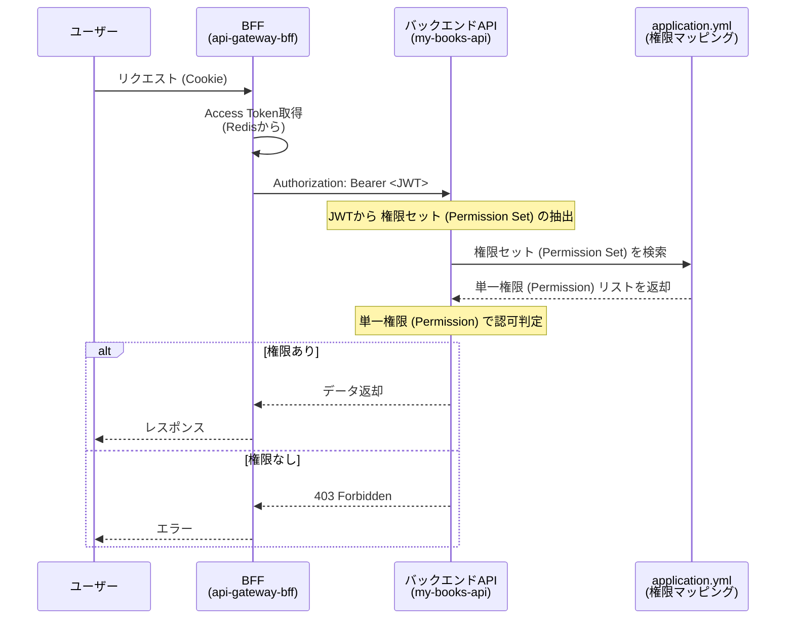
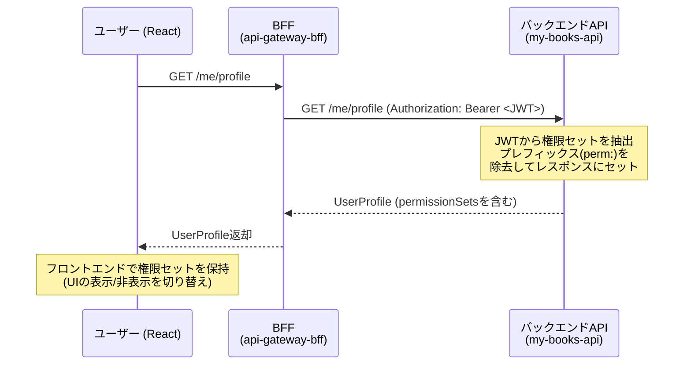

# アプリケーション 権限設計

## 1. 設計方針: 「単一権限」「権限セット」「役割」の分離

本設計では、アクセス権限を **「単一権限 (Permisson)」** と **「権限セット (Permission Set)」** と **「役割 (Group)」** の 3 層構造で管理します。これにより、ビジネス上の役割と技術的な権限を分離し、管理性と柔軟性を両立させます。

| 要素                               | 用途                                                                    | 例                                           |
| ---------------------------------- | ----------------------------------------------------------------------- | -------------------------------------------- |
| **単一権限**<br>(Permission)       | 「何ができるか」という最小単位の権限。<br>APIを直接保護する。           | `book-content:read:any`<br>`user:read:own`   |
| **権限セット**<br>(Permission Set) | 再利用可能な単一権限の集合体。<br>役割(Group)に割り当てるテンプレート。 | `premium-user`<br>`moderator`                |
| **役割**<br>(Group)                | ビジネス上の立場や所属。<br>ユーザー管理の単位。                        | `/Users/Premium Users`<br>`/Staff/Moderator` |

---

## 2. 単一権限 (Permission) の命名規則

単一権限 (Permission) の命名規則は `{リソース}:{アクション}:{スコープ}` の形式を基本とします。リソース、アクション、スコープは完全明示（省略不可）

1. リソース (Resource): 操作の対象となるもの（名詞・単数形）

   例: book, review, user, favorite

2. アクション (Action): 何ができるのか（動詞）

   例: read, create, update, delete, manage

3. スコープ (Scope): どのデータを対象とするか（誰の/どの範囲の）

   例: any, own, department, team

### アクション (Action)

「何ができるのか」を定義します。CRUD 操作をベースに、より直感的な単語を選びます。

| アクション | 意味・用途                                       | サービス層のメソッド例     |
| ---------- | ------------------------------------------------ | -------------------------- |
| `read`     | データの取得                                     | get..., find..., search... |
| `create`   | データの作成                                     | create..., register...     |
| `update`   | データの編集                                     | update..., patch...        |
| `delete`   | データの削除                                     | delete..., remove...       |
| `manage`   | read / create / update / delete をすべて包含する |                            |
| `exec`     | 計算やバッチ、送金などの実行                     | execute..., process...     |

- 判定ロジックでは `manage` を最優先で許可とし、必要に応じて `read`, `create`, ... などを追加する。

### スコープ (Scope)

「誰の・どの範囲のデータに」を定義します。

| スコープ     | 意味                     | 判定ロジックの基準                      |
| ------------ | ------------------------ | --------------------------------------- |
| `any`        | すべてのデータ           |                                         |
| `own`        | 自身のデータのみ         | data.userId === user.id                 |
| `department` | 所属組織内のデータのみ   | data.departmentId === user.departmentId |
| `team`       | 所属チーム内のデータのみ | data.teamId === userteamId              |
| `public`     | 公開されているデータのみ | data.isPublic === true                  |

## 3. 単一権限 (Permission)

| 対象             | 単一権限 (Permission)   | 説明                                                 |
| ---------------- | ----------------------- | ---------------------------------------------------- |
| **書籍**         | `book:manage:any`       | すべての書籍を閲覧・作成・編集・削除できる権限       |
|                  | `book-preview:read:any` | すべての試し読みコンテンツを閲覧できる権限           |
|                  | `book-content:read:any` | すべての有料コンテンツを閲覧できる権限               |
| **お気に入り**   | `favorite:manage:own`   | 自身のお気に入りを閲覧・作成・編集・削除できる権限   |
| **ブックマーク** | `bookmark:read:own`     | 自身のブックマークを閲覧できる権限                   |
|                  | `bookmark:manage:own`   | 自身のブックマークを閲覧・作成・編集・削除できる権限 |
| **レビュー**     | `review:read:own`       | 自身のレビューを閲覧できる権限                       |
|                  | `review:manage:own`     | 自身のレビューを閲覧・作成・編集・削除できる権限     |
|                  | `review:delete:any`     | すべてのレビューを削除できる権限                     |
| **ジャンル**     | `genre:manage:any`      | すべてのジャンルを閲覧・作成・編集・削除できる権限   |
| **ユーザー**     | `user:read:own`         | 自身のプロフィールを閲覧できる権限                   |
|                  | `user:update:own`       | 自身のプロフィールを編集できる権限                   |
|                  | `user:manage:any`       | すべてのユーザーを閲覧・作成・編集・削除できる権限   |

※バックエンドは、**「単一権限 (Permission)」** を元にアクセス管理を行う。

---

## 4. 権限セット (Permission Set)

アプリケーションで利用する主な権限セットとして、以下のものを定義します。この権限セット (Permission Set) は権限の組み合わせで作成します。

| 権限セット (Permission Set) | 説明                             | 想定ユーザー                                                                                                 |
| --------------------------- | -------------------------------- | ------------------------------------------------------------------------------------------------------------ |
| なし                        | **未ログインユーザー**           | 未ログインユーザー。書籍の検索、概要や目次の閲覧、書籍へのレビュー一覧などは見れる。                         |
| `general-user`              | **一般ユーザー**<br>(デフォルト) | 無料登録したすべてのユーザー用の権限セット。書籍の閲覧や自身のお気に入り管理が可能。                         |
| `premium-user`              | **プレミアムユーザー**           | 月額課金ユーザー用の権限セット。有料コンテンツの閲覧、レビュー、ブックマークなど追加機能へのアクセスが可能。 |
| `content-editor`            | **コンテンツ編集者**             | 書籍のメタデータやジャンルを管理するスタッフ用の権限セット。                                                 |
| `moderator`                 | **コミュニティ管理者**           | 不適切なレビューの削除など、コミュニティの健全性を維持するスタッフ用の権限セット。                           |
| `admin`                     | **システム管理者**               | すべての権限を持つシステム管理者用の権限セット。ユーザー管理やシステム設定も可能。                           |

※フロントエンドは、**「権限セット (Permission Set)」** を元にアクセス管理を行う。

※ 未ログインユーザーは JWT を持たず、権限セット (Permission Set) も付与されない特殊ケースとする。バックエンドでは、これらのユーザー向け API を明示的に permitAll() として定義する。

---

## 5. 権限セットと単一権限のマトリックス

各権限セット (Permission Set) にどの単一権限 (Permission) が含まれるかを以下に示します。

| 権限                    | `general-user` | `premium-user` | `content-editor` | `moderator` | `admin` |
| ----------------------- | :------------: | :------------: | :--------------: | :---------: | :-----: |
| `book:manage:any`       |                |                |        ✅        |             |   ✅    |
| `book-preview:read:any` |       ✅       |       ✅       |                  |             |   ✅    |
| `book-content:read:any` |                |       ✅       |                  |             |   ✅    |
| `favorite:manage:own`   |       ✅       |       ✅       |                  |             |   ✅    |
| `bookmark:read:own`     |       ✅       |                |                  |             |   ✅    |
| `bookmark:manage:own`   |                |       ✅       |                  |             |   ✅    |
| `review:read:own`       |       ✅       |                |                  |             |   ✅    |
| `review:manage:own`     |                |       ✅       |                  |             |   ✅    |
| `review:delete:any`     |                |                |                  |     ✅      |   ✅    |
| `genre:manage:any`      |                |                |        ✅        |             |   ✅    |
| `user:read:own`         |       ✅       |       ✅       |                  |             |   ✅    |
| `user:update:own`       |       ✅       |       ✅       |                  |             |   ✅    |
| `user:manage:any`       |                |                |                  |             |   ✅    |

- **`general-user`** は、新規登録時のデフォルト権限セットとして設定します。
- **※補足:** `Content Editors` や `Moderators` などのスタッフ系役割 (`Group`)には、管理機能の権限セットに加えて `premium-user` 権限セットも付与されます。

---

## 6. 実装ガイドライン

### バックエンド (Spring Security)

- JWT には Permission Set のみを含める（トークン肥大化を防ぐ）
- 単一権限への展開はバックエンドで行う（IdP非依存性を保つ）
- 各APIサーバーが独自の権限マッピングを持つ（アプリケーション間の独立性）



```
JWT (Keycloakから発行)
  ↓
  "realm_access": {
    "roles": [
      "default-roles-sample-realm",
      "offline_access",
      "perm:premium-user",     ←「perm:」プレフィックスがついたものが権限セット (Permission Set)
      "perm:content-editor"
    ]
  },
  ↓
バックエンドAPI (Spring Security) ←「perm:」プレフィックスがついた権限セットだけを抽出し、プレフィックスなしのリストに整形する
  ↓
application.yml から permission_sets をキーに検索
  ↓
permission-sets:
  mappings:
    premium-user:
      - book-preview:read:any
      - book-content:read:any      ← これらに展開
      - favorite:manage:own
      - bookmark:manage:own
      - review:manage:own
      - user:read:own
      - user:update:own
  ↓
Spring Security の GrantedAuthority に変換
  ↓
@PreAuthorize("hasAuthority('book-content:read:any')") で使用
```

- API のエンドポイント保護には、権限セット (Permission Set) ではなく、**単一権限 (Permission)** を直接指定することを推奨します。これにより、API が必要とする権限が明確になります。
- Spring Security の `hasAuthority()` や `@PreAuthorize` を利用します。

```java
// SecurityConfig.java
.requestMatchers(HttpMethod.POST, "/api/books").hasAuthority("book:manage:any")
.requestMatchers(HttpMethod.DELETE, "/api/bookmarks/**").hasAuthority("bookmark:manage:own")
.requestMatchers(HttpMethod.GET, "/api/book-content/**").hasAuthority("book-content:read:any")

// BookmarkServiceImpl.java
@Override
@Transactional
@PreAuthorize("hasAuthority('bookmark:manage:own')")
public void deleteBookmark(@NonNull Long id) {
    Bookmark bookmark = bookmarkRepository.findById(id)
        .orElseThrow(() -> new NotFoundException("Bookmark not found"));

    String userId = jwtClaimExtractor.getUserId();
    if (!bookmark.getUser().getId().equals(userId)) {
        throw new ForbiddenException("削除する権限がありません");
    }

    bookmark.setIsDeleted(true);
    bookmarkRepository.save(bookmark);
}

// ※スコープ（own / team / department）の具体的な判定は、サービス層のメソッド内で行う。PreAuthorize は「権限の有無」だけを判定する。
```

### フロントエンド (React)

- フロントエンドは /me/profile から権限セットを含むプロファイルを取得し、UI表示制御に利用する。
- UI 要素（ボタン、メニューなど）の表示/非表示の制御に **権限セット (Permission Set)** を使用します。
- `useAuth` のようなカスタムフック（全体で使うプロバイダー）で、ユーザーが持つ権限セットを簡単に判定できるようにします。



```typescript
// permission-sets.ts
export const PermissionSet = {
  GeneralUser: "general-user",
  PremiumUser: "premium-user",
  ContentEditor: "content-editor",
  Moderator: "moderator",
  Admin: "admin",
} as const;

export type PermissionSet = (typeof PermissionSet)[keyof typeof PermissionSet];

// user.ts
// ログインユーザーのプロフィール情報
export type UserProfile = {
  id: number;
  displayName: string;
  avatarPath: string;
  username: string;
  email: string;
  familyName: string;
  givenName: string;
  permissionSets: PermissionSet[]; // 例: ["premium-user", "general-user"]
};

// protected-router.tsx
// 指定した権限セットをユーザーが持っているか確認する
const hasPermissionSet = useCallback(
   (permissionSet: PermissionSet) =>
   !!userProfile?.permissionSets.includes(permissionSet),
   [userProfile]
);

// 指定した権限セットのうち、いずれかをユーザーが持っているか確認する
const hasAnyPermissionSet = useCallback(
   (permissionSets: PermissionSet[]) =>
   permissionSets.some((permissionSet) => hasPermissionSet(permissionSet)),
   [hasPermissionSet]
);

// permission-guard.tsx
export default function PermissionGuard({ permissionSets, children }: Props) {
  const { hasAnyPermissionSet } = useAuth();

  if (!hasAnyPermissionSet(permissionSets)) return null;

  return <>{children}</>;
}

// Component.tsx
{
  <PermissionGuard permissionSets={ [PermissionSet.PremiumUser, PermissionSet.Admin] }>
    <Button>有料コンテンツを読む</Button>
  </PermissionGuard>;
}
```

**重要**: フロントエンドでの表示制御はあくまで UI/UX 向上のためです。**最終的なアクセス可否の判断は、必ずバックエンドの API で行う必要があります。**

---

## 7. Group 機能の活用 (Keycloak)

ここまでの設計は権限だけでも十分に機能しますが、ユーザー数が多くなったり、組織的な運用が始まったりした場合には、**Group 機能**を活用するとユーザー管理が格段に効率化します。

### Group とは？

Group は、ユーザーを「組織」や「チーム」といった集団で管理するための機能です。

- **Permission** が「何ができるか（権限）」を定義するのに対し、
- **Group** は「誰がどこに所属しているか（所属）」を表現します。

Group に特定の権限セット（Permission Set）を紐付けておくことで、ユーザーを Group に追加・移動するだけで、自動的に権限が付与・変更される仕組みを構築できます。

### my-books における Group 設計例

以下に`my-books`アプリケーションのための Group 構造案を示します。

```
/
├── Users (ユーザー)
│   ├── General Users (一般ユーザー)
│   └── Premium Users (プレミアムユーザー)
└── Staff (運営チーム)
    ├── Admins (システム管理者)
    ├── Content Editors (コンテンツ編集チーム)
    └── Moderators (コミュニティ管理チーム)
```

### Group と Permission Set の紐付け

| Group                    | 紐付ける権限セット (Permission Set) |
| ------------------------ | ----------------------------------- |
| `/Users/General Users`   | `general-user`                      |
| `/Users/Premium Users`   | `premium-user`                      |
| `/Staff/Admins`          | `admin`                             |
| `/Staff/Content Editors` | `content-editor`<br>`premium-user`  |
| `/Staff/Moderators`      | `moderator`<br>`premium-user`       |

### Group 活用のメリット: 役割変更の簡素化

例えば、あるスタッフが「コンテンツ編集者」から「コミュニティ管理者」に異動になった場合、管理者が行う作業は以下の通りです。

1.  対象ユーザーの所属を `/Staff/Content Editors` Group から外す。
2.  対象ユーザーを `/Staff/Moderators` Group に追加する。

これだけで、Keycloak は自動的に古い `content-editor` 権限セットを剥奪し、新しい `moderator` 権限セットを付与します。個別の権限を付け替える人的ミスを防ぎ、管理を大幅に簡素化できます。

ユーザーの役割変更や昇格・降格が頻繁に発生する可能性がある場合は、この Group 設計の導入を強く推奨します。

## 8. 設計の注意点

1. 「単一権限 (Permission)」と「権限セット (Permission Set)」と「役割 (Group)」の使い分け

   バックエンドはサービス層にて、 **「単一権限 (Permission)」** を元にアクセス管理を行う。フロントエンドは、 **「権限セット (Permission Set)」** を元にアクセス管理を行う。そしてユーザー管理は、 **「役割 (Group)」** で行います。これにより運用で破綻しにくい設計となる。

2. 「manage」権限を戦略的に使う

   細かく分けすぎると管理が破綻します。「コンテンツ編集者なら書籍の作成・編集・削除すべてできて当然」というリソースについては、個別に分けず `book:manage:any` １つで運用し、必要になったタイミングで分割するのが現実的です。

3. 否定形 (not) の単一権限は作らない

   「○○ できない」という単一権限を作成すると、複数の権限が合算されたときに論理破綻（Allow と Deny の競合）が起きやすくなります。権限は常に **「できることの積み上げ（ホワイトリスト方式）」** で設計してください。

## 9. 公開 API (permitAll)

以下の機能は認証を必要とせず、すべてのユーザー（未ログインユーザー含む）が利用できます。
バックエンドでは、これらの API エンドポイントを `permitAll()` もしくは同等の設定にする必要があります。

| 機能分類     | エンドポイント（例）          | HTTP メソッド | 説明                                           |
| :----------- | :---------------------------- | :------------ | :--------------------------------------------- |
| **書籍**     | `/api/books`                  | `GET`         | 書籍の一覧を検索・取得する                     |
|              | `/api/books/{bookId}`         | `GET`         | 特定の書籍の詳細（概要、目次）を取得する       |
| **レビュー** | `/api/books/{bookId}/reviews` | `GET`         | 特定の書籍に投稿されたレビューの一覧を取得する |
| **ジャンル** | `/api/genres`                 | `GET`         | ジャンルの一覧を取得する                       |
