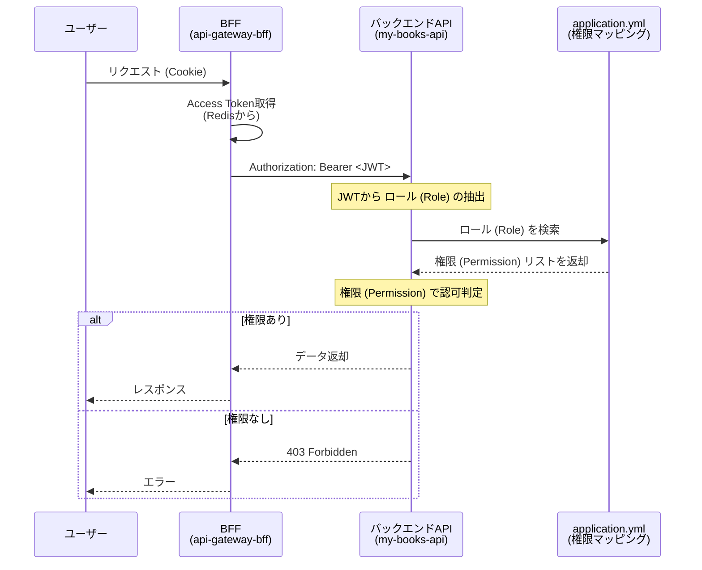
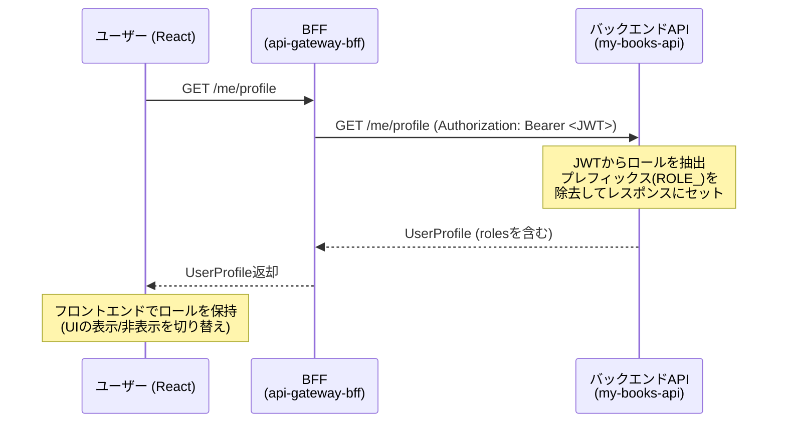

# ロール設計

## 1. 設計方針: 「権限」と「役割」との分離

本設計では、ロールを **「権限 (Permission)」** と **「役割 (Role)」** の 2 層構造で管理します。

| 要素                  | 用途                                 | 例                                       |
| --------------------- | ------------------------------------ | ---------------------------------------- |
| **権限 (Permission)** | 「何ができるか」という最小単位の権限 | `book-content:read`, `review:delete:own` |
| **役割 (Role)**       | 職務に応じた権限の集まり             | `ui:premium-user`, `ui:moderator`        |

## 2. 権限 (Permission) の命名規則

権限 (Permission) の命名規則は `{リソース}:{アクション}:{スコープ}` の形式を基本とします。リソース、アクション、スコープは完全明示（省略不可）

1. リソース (Resource): 操作の対象となるもの（名詞・単数形）

   例: book, review, user, favorite

2. アクション (Action): 何ができるのか（動詞）

   例: read, create, update, delete, manage

3. スコープ (Scope): どのデータを対象とするか（誰の/どの範囲の）

   例: all, own, department, team

### アクション (Action)

「何ができるのか」を定義します。CRUD 操作をベースに、より直感的な単語を選びます。

| アクション | 意味・用途                                       | サービス層のメソッド例     |
| ---------- | ------------------------------------------------ | -------------------------- |
| `read`     | データの取得                                     | get..., find..., search... |
| `create`   | データの作成                                     | create..., register...     |
| `update`   | データの編集                                     | update..., patch...        |
| `delete`   | データの削除                                     | delete..., remove...       |
| `manage`   | read / create / update / delete をすべて包含する |                            |

- 判定ロジックでは `manage` を最優先で許可とし、必要に応じて `read`, `create`, ... などを追加する。

### スコープ (Scope)

「誰の・どの範囲のデータに」を定義します。

| スコープ     | 意味                     | 判定ロジックの基準                      |
| ------------ | ------------------------ | --------------------------------------- |
| `all`        | すべてのデータ           |                                         |
| `own`        | 自身のデータのみ         | data.userId === user.id                 |
| `department` | 所属組織内のデータのみ   | data.departmentId === user.departmentId |
| `team`       | 所属チーム内のデータのみ | data.teamId === userteamId              |
| `public`     | 公開されているデータのみ | data.isPublic === true                  |

## 3. 権限 (Permission)

| 対象             | 単一権限 (Permission)   | 説明                                                 |
| ---------------- | ----------------------- | ---------------------------------------------------- |
| **書籍**         | `book:manage:all`       | すべての書籍を閲覧・作成・編集・削除できる権限       |
|                  | `book-content:read:all` | すべての有料コンテンツを閲覧できる権限               |
| **お気に入り**   | `favorite:manage:own`   | 自身のお気に入りを閲覧・作成・編集・削除できる権限   |
| **ブックマーク** | `bookmark:manage:own`   | 自身のブックマークを閲覧・作成・編集・削除できる権限 |
| **レビュー**     | `review:read:all`       | すべてのレビューを閲覧できる権限                     |
|                  | `review:manage:own`     | 自身のレビューを閲覧・作成・編集・削除できる権限     |
|                  | `review:delete:all`     | すべてのレビューを削除できる権限                     |
| **ジャンル**     | `genre:manage:all`      | すべてのジャンルを閲覧・作成・編集・削除できる権限   |
| **ユーザー**     | `user:manage:all`       | すべてのユーザーを閲覧・作成・編集・削除できる権限   |
|                  | `user:read:own`         | 自身のプロフィールを閲覧できる権限                   |
|                  | `user:update:own`       | 自身のプロフィールを編集できる権限                   |

※バックエンドは、**「権限 (Permission)」** を元にアクセス管理を行う。

## 4. 役割 (Role)

アプリケーションで利用する主な役割として、以下の 5 つを定義します。この役割 (Role) は権限の組み合わせで作成する。

| 役割 (Permission)    | 説明                   | 想定ユーザー                                                                                                                                                               |
| -------------------- | ---------------------- | -------------------------------------------------------------------------------------------------------------------------------------------------------------------------- |
| なし                 | **未ログインユーザー** | 未ログインユーザー。書籍の検索、概要や目次の閲覧、書籍へのレビュー一覧などは見れる。                                                                                       |
| **`USER`**           | **承認済みユーザー**   | 未ログインユーザーのできることに加え、レビュー投稿、ブックマーク管理など追加機能へのアクセスが可能。ユーザー情報の中のsubscriptionPlanの情報を元にできる範囲は制限される。 |
| **`CONTENT_EDITOR`** | **コンテンツ編集者**   | 書籍のメタデータやジャンルを管理するスタッフ。                                                                                                                             |
| **`MODERATOR`**      | **コミュニティ管理者** | 不適切なレビューの削除など、コミュニティの健全性を維持するスタッフ。                                                                                                       |
| **`ADMIN`**          | **システム管理者**     | すべての権限を持つシステム管理者。ユーザー管理やシステム設定も可能。                                                                                                       |

※フロントエンドは、**「役割 (Role)」** を元にアクセス管理を行う。

## 5. 権限マトリックス

各役割 (Role) にどの権限 (Permission) が含まれるかを以下に示します。

| 権限                    | `USER` | `CONTENT_EDITOR` | `MODERATOR` | `ADMIN` |
| ----------------------- | :----: | :--------------: | :---------: | :-----: |
| `book:manage:all`       |        |        ✅        |             |   ✅    |
| `book-content:read:all` |   ✅   |                  |             |   ✅    |
| `favorite:manage:own`   |   ✅   |                  |             |   ✅    |
| `bookmark:manage:own`   |   ✅   |                  |             |   ✅    |
| `review:read:all`       |   ✅   |                  |     ✅      |   ✅    |
| `review:manage:own`     |   ✅   |                  |             |   ✅    |
| `review:delete:all`     |        |                  |     ✅      |   ✅    |
| `genre:manage:all`      |        |        ✅        |             |   ✅    |
| `user:manage:all`       |        |                  |             |   ✅    |
| `user:read:own`         |   ✅   |                  |             |   ✅    |
| `user:update:own`       |   ✅   |                  |             |   ✅    |

- **`USER`** は、新規登録時のデフォルトロールとして設定します。
- **※補足:** `CONTENT_EDITOR` や `MODERATOR` などのスタッフ系グループには、管理機能の役割に加えて `USER` ロールも付与されます。これにより、スタッフは自身の担当業務に加え、お気に入り管理などの一般ユーザー向け機能も利用できます。

## 6. 実装ガイドライン

### バックエンド (Spring Security)

- JWT には Role のみを含める（トークン肥大化を防ぐ）
- 単一権限への展開はバックエンドで行う（IdP非依存性を保つ）
- 各APIサーバーが独自の権限マッピングを持つ（アプリケーション間の独立性）



```
JWT (Keycloakから発行)
  ↓
  "realm_access": {
    "roles": [
      "default-roles-sample-realm",
      "offline_access",
      "ROLE_USER"     ←「ROLE_」プレフィックスがついたものがロール (Role)
    ]
  },
  ↓
バックエンドAPI (Spring Security) ←「ROLE_」プレフィックスがついたロールだけを抽出し、プレフィックスなしのリストに整形する
  ↓
application.yml から roles をキーに検索
  ↓
roles:
  mappings:
    USER:
      - book-content:read:all      ← これらに展開
      - favorite:manage:own
      - bookmark:manage:own
      - review:read:all
      - review:manage:own
      - user:read:own
      - user:update:own
  ↓
Spring Security の GrantedAuthority に変換
  ↓
@PreAuthorize("hasAuthority('book-content:read:all')") で使用
```

- API のエンドポイント保護には、役割 (Role) ではなく、**権限 (Permission)** を直接指定することを推奨します。これにより、API が必要とする権限が明確になります。
- Spring Security の `hasAuthority()` や `@PreAuthorize` を利用します。

```java
// SecurityConfig.java
.requestMatchers(HttpMethod.POST, "/api/books").hasAuthority("book:manage:all")
.requestMatchers(HttpMethod.DELETE, "/api/bookmarks/**").hasAuthority("bookmark:manage:own")
.requestMatchers(HttpMethod.GET, "/api/book-content/**").hasAuthority("book-content:read:all")

// BookmarkServiceImpl.java
@Override
@Transactional
@PreAuthorize("hasAuthority('bookmark:manage:own')")
public void deleteBookmark(@NonNull Long id) {
    Bookmark bookmark = bookmarkRepository.findById(id)
        .orElseThrow(() -> new NotFoundException("Bookmark not found"));

    String userId = jwtClaimExtractor.getUserId();
    if (!bookmark.getUser().getId().equals(userId)) {
        throw new ForbiddenException("削除する権限がありません");
    }

    bookmark.setIsDeleted(true);
    bookmarkRepository.save(bookmark);
}

// ※スコープ（own / team / department）の具体的な判定は、サービス層のメソッド内で行う。PreAuthorize は「権限の有無」だけを判定する。
```

### フロントエンド (React)

- フロントエンドは /me/profile からロールを含むプロフィールを取得し、UI表示制御に利用する。
- UI 要素（ボタン、メニューなど）の表示/非表示の制御に **ロール (Role)** を使用します。
- `useAuth` のようなカスタムフック（全体で使うプロバイダー）で、ユーザーが持つロールを簡単に判定できるようにします。
- プロフィール情報に含まれている `subscriptionPlan` の値を元に閲覧できる範囲などを制御する。



```typescript
// roles.ts
export const Role = {
  USER: "USER",
  CONTENT_EDITOR: "CONTENT_EDITOR",
  MODERATOR: "MODERATOR",
  ADMIN: "ADMIN",
} as const;

export type Role = (typeof Role)[keyof typeof Role];

// user.ts
// ログインユーザーのプロフィール情報
export type UserProfile = {
  id: number;
  displayName: string;
  avatarPath: string;
  subscriptionPlan: string;
  username: string;
  email: string;
  familyName: string;
  givenName: string;
  roles: Role[]; // 例: ["USER", "CONTENT_EDITOR"]
};

// protected-router.tsx
// 指定したロールをユーザーが持っているか確認する
const hasRole = useCallback(
   (role: Role) => !!userProfile?.roles.includes(role),
   [userProfile]
);

// 指定したロールのうち、いずれかをユーザーが持っているか確認する
const hasAnyRole = useCallback(
   (roles: Role[]) => roles.some((role) => hasRole(role)),
   [hasRole]
);

// role-guard.tsx
export default function RoleGuard({ roles, children }: Props) {
  const { hasAnyRole } = useAuth();

  if (!hasAnyRole(roles)) return null;

  return <>{children}</>;
}

// Component.tsx
{
  <RoleGuard roles={ [Role.CONTENT_EDITOR, Role.ADMIN] }>
    <Button>書籍を新規登録する</Button>
  </RoleGuard>;
}
```

**重要**: フロントエンドでの表示制御はあくまで UI/UX 向上のためです。**最終的なアクセス可否の判断は、必ずバックエンドの API で行う必要があります。**

## 7. Group 機能の活用 (Keycloak)

ここまでの設計はロールだけでも十分に機能しますが、ユーザー数が多くなったり、組織的な運用が始まったりした場合には、**Group 機能**を活用するとユーザー管理が格段に効率化します。

### グループ (Group) とは？

グループ (Group) は、ユーザーを「組織」や「チーム」といった集団で管理するための機能です。

- **Permission** は「何ができるか（権限）」
- **Role** は「どんな職務を行えるか（役割）」
- **Group** は「どこに所属しているか（所属）」

グループ (Group) に特定のロール（Role）を紐付けておくことで、ユーザーを Group に追加・移動するだけで、自動的にロールが付与・変更される仕組みを構築できます。

### my-books における グループ (Group) 設計例

以下に`my-books`アプリケーションのための グループ (Group) 構造案を示します。

```
/
├── users (ユーザー)
│   ├── domestic-users (国内ユーザー)
│   └── international-users (海外ユーザー)
└── staff (運営チーム)
    ├── admins (システム管理者)
    ├── content-editors (コンテンツ編集チーム)
    └── moderators (コミュニティ管理チーム)
```

### グループ (Group) と ロール (Role) の紐付け

| グループ (Group)             | 紐付ける役割 (Role)   | グループとしての意味   |
| ---------------------------- | --------------------- | ---------------------- |
| `/users/domestic-users`      | -                     | 国内ユーザー           |
| `/users/international-users` | -                     | 海外ユーザー           |
| `/staff/admins`              | `ROLE_ADMIN`          | システム管理者         |
| `/staff/content-editors`     | `ROLE_CONTENT_EDITOR` | コンテンツ編集チーム   |
| `/staff/moderators`          | `ROLE_MODERATOR`      | コミュニティ管理チーム |

### Group 活用のメリット: 役割変更の簡素化

例えば、あるスタッフが「コンテンツ編集者」から「コミュニティ管理者」に異動になった場合、管理者が行う作業は以下の通りです。

1.  対象ユーザーの所属を `/staff/content-editors` Group から外す。
2.  対象ユーザーを `/staff/moderators` Group に追加する。

これだけで、Keycloak は自動的に古い `ROLE_CONTENT_EDITOR` ロールを剥奪し、新しい `ROLE_MODERATOR` ロールを付与します。個別のロールを付け替える人的ミスを防ぎ、管理を大幅に簡素化できます。

ユーザーの役割変更や昇格・降格が頻繁に発生する可能性がある場合は、この Group 設計の導入を強く推奨します。

## 8. ロール設計の注意点

1. 「権限 (Permission)」と「役割 (Role)」の使い分け

   バックエンドはサービス層にて、**「権限 (Permission)」**を元にアクセス管理を行う。フロントエンドは、**「役割 (Role)」**を元にアクセス管理を行う。そして所属は、 **「グループ (Group)」** で行います。これにより運用で破綻しにくい設計となる。

2. 「manage」権限を戦略的に使う

   細かく分けすぎると管理が破綻します。「コンテンツ編集者なら書籍の作成・編集・削除すべてできて当然」というリソースについては、個別に分けず `book:manage:all` １つで運用し、必要になったタイミングで分割するのが現実的です。

3. 否定形 (not) の単一権限は作らない

   「○○ できない」という単一権限を作成すると、複数の権限が合算されたときに論理破綻（Allow と Deny の競合）が起きやすくなります。権限は常に **「できることの積み上げ（ホワイトリスト方式）」** で設計してください。

## 9. 公開 API (permitAll)

以下の機能は認証を必要とせず、すべてのユーザー（未ログインユーザー含む）が利用できます。
バックエンドでは、これらの API エンドポイントを `permitAll()` もしくは同等の設定にする必要があります。

| 機能分類     | エンドポイント（例）                                                       | HTTP メソッド | 説明                                                 |
| :----------- | :------------------------------------------------------------------------- | :------------ | :--------------------------------------------------- |
| **書籍**     | `/api/books`                                                               | `GET`         | 書籍の一覧を検索・取得する                           |
|              | `/api/books/{bookId}`                                                      | `GET`         | 特定の書籍の詳細（概要）を取得する                   |
|              | `/api/books/{bookId}/toc`                                                  | `GET`         | 特定の書籍の目次を取得する                           |
|              | `/api/books/{bookId}/preview-setting`                                      | `GET`         | 特定の書籍の試し読み設定を取得する                   |
|              | `/api/books/{bookId}/stats/reviews`                                        | `GET`         | 特定の書籍のレビュー統計（評価平均・件数）を取得する |
|              | `/api/books/{bookId}/stats/favorites`                                      | `GET`         | 特定の書籍のお気に入り統計（件数）を取得する         |
| **試し読み** | `/api/book-content/preview/books/{bookId}/chapters/{chapter}/pages/{page}` | `GET`         | 試し読み設定に基づいた無料ページコンテンツを取得する |
| **ジャンル** | `/api/genres`                                                              | `GET`         | ジャンルの一覧を取得する                             |
|              | `/api/genres/{genreId}`                                                    | `GET`         | 特定のジャンルを取得する                             |

## 10. subscriptionPlanについて

`subscriptionPlan` は「契約状態を表す属性」であり、認可の補助情報である。

つまり、

- Role = 主体（Subject）の属性
- subscriptionPlan = 契約状態（Contract attribute）
- Permission = 操作権限

アプリDB内で保持しており、`/me` エンドポイントで情報を取得する。

```java
public class UserResponse {
    private String id;
    private String displayName;
    private String avatarPath;
    private String subscriptionPlan;
}
```

### 認可レイヤーの責務分離

どこで判定するのか（層の責務）は以下のようになります。

| レイヤー        | 判定内容                             |
| --------------- | ------------------------------------ |
| BFF             | ログイン状態                         |
| API Gateway     | 認証のみ                             |
| Resource Server | Role + subscriptionPlan に基づく認可 |

### subscriptionPlan による機能制限マトリックス

USERロール保持者の中で、subscriptionPlan（FREE / PREMIUM）により利用可能な機能を制限する。

| 機能                           | 未ログイン | FREE | PREMIUM | 備考                                           |
| ------------------------------ | :--------: | :--: | :-----: | ---------------------------------------------- |
| 書籍一覧・検索                 |     ✅     |  ✅  |   ✅    | パブリック（認証不要）                         |
| 書籍詳細・目次閲覧             |     ✅     |  ✅  |   ✅    | パブリック（認証不要）                         |
| 書籍コンテンツ（試し読み範囲） |     ✅     |  ✅  |   ✅    | 試し読み設定に基づく                           |
| 書籍コンテンツ（全文）         |     ❌     |  ❌  |   ✅    | `UpgradeRequiredException`                     |
| レビュー閲覧                   |     ❌     |  ✅  |   ✅    | `review:read:all` 権限が必要（認証必須）       |
| レビュー投稿・編集・削除       |     ❌     |  ❌  |   ✅    | `UpgradeRequiredException`                     |
| お気に入り管理                 |     ❌     |  ✅  |   ✅    | `favorite:manage:own` 権限が必要（認証必須）   |
| ブックマーク（全操作）         |     ❌     |  ❌  |   ✅    | `UpgradeRequiredException`                     |
| ユーザー情報閲覧・編集         |     ❌     |  ✅  |   ✅    | `user:read:own` / `user:update:own` 権限が必要 |

**実装パターン**: サービス層で `SubscriptionService.isPremium(userId)` を使用し、`false` の場合は `UpgradeRequiredException` をスローする。`GlobalExceptionHandler` がこれを HTTP 403 + `UPGRADE_REQUIRED` エラーコードに変換し、フロントエンドはエラーコードを見てアップグレード案内を表示する。
